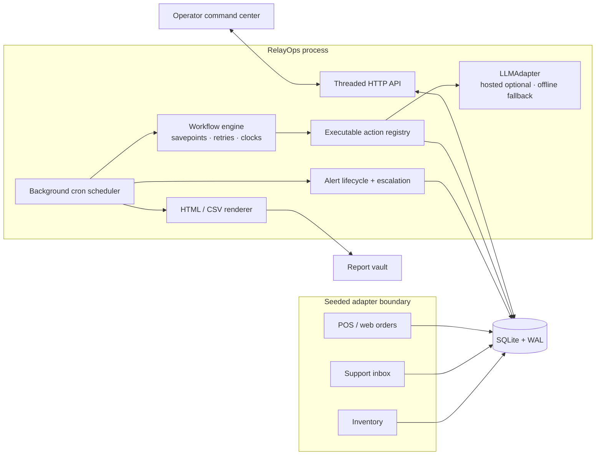
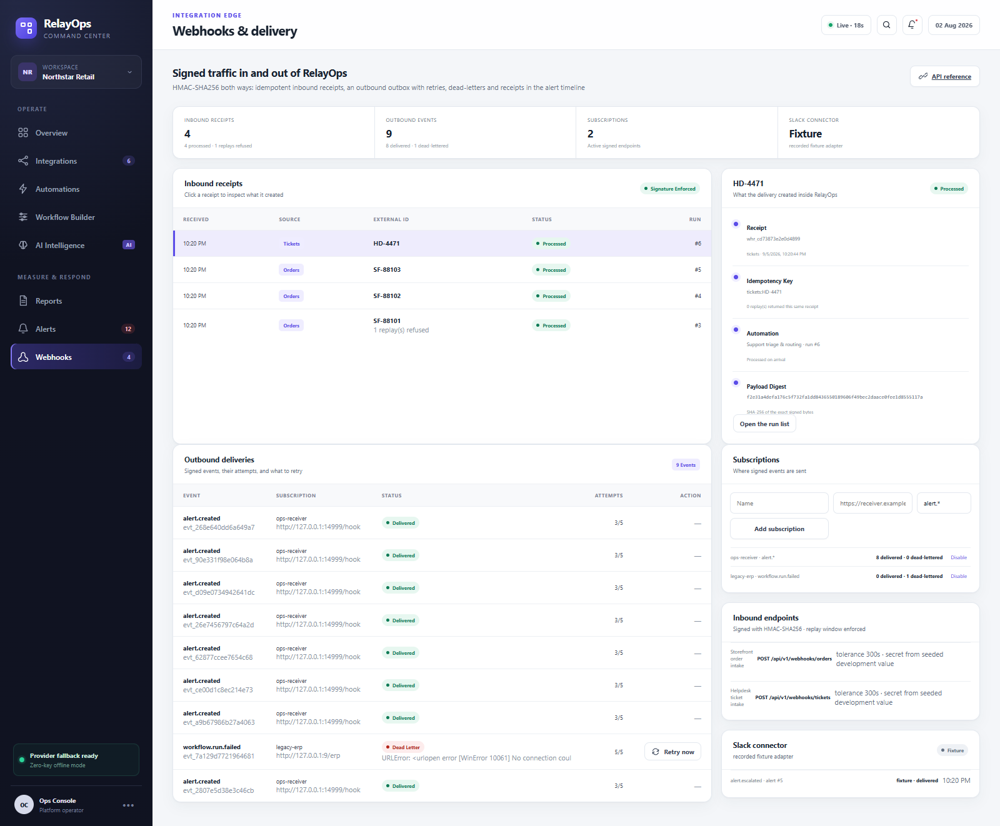
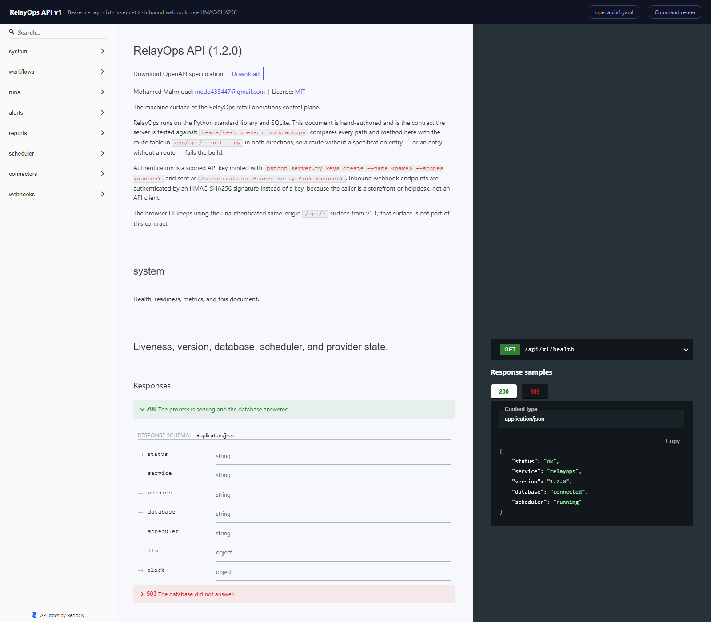

# RelayOps — AI Automation & Integration Command Center


[](https://github.com/Mohamed3042/ai-automation-command-center/actions/workflows/ci.yml)


RelayOps is a self-contained retail operations control plane. It executes its workflows against SQLite, measures real runtimes and row counts, dispatches cron jobs from a background scheduler, lets operators build workflows in the UI, and tracks alerts from acknowledgement through resolution.

Version 1.2 gives it an integration edge: a versioned `/api/v1` with scoped API keys and a hand-authored OpenAPI 3.1 document, HMAC-signed webhooks in both directions, three n8n workflows that CI imports into a real n8n container and executes, a Slack connector, a Docker image, Prometheus metrics and JSON logs.

The application runtime still has no third-party Python dependency and requires no key — and a test now enforces that rather than promising it. An optional OpenAI-compatible classification provider can be enabled with an environment variable; a deterministic offline adapter remains the automatic fallback.


## What is real in the engine

- Order automation reads twelve staged POS/web orders, validates them, writes canonical orders, posts balanced debit/credit ledger entries, and refreshes the KPI cache.
- Support automation reads only unclassified tickets, calls `LLMAdapter`, persists category/confidence/priority, applies SLA rules, and writes queue assignments.
- Inventory automation snapshots stock, refreshes the forecast cache, creates deduplicated replenishment tasks, and records buyer-queue messages.
- Finance close aggregates sales rows, reconciles the posted ledger, writes HTML/CSV files, and records distribution.
- Every attempt has a clock-measured duration, actual row count, output/error payload, and configured retry/backoff policy. Terminal failures persist downstream skips and create an alert.
- A daemon scheduler evaluates five-field UTC cron expressions, fires workflow and report jobs, advances next-run times, records scheduler events, and enforces overdue alert escalation.
- The workflow builder creates, edits, reorders, enables, and pauses persisted definitions and executable steps.
- Alerts follow the strict lifecycle `open → acknowledged → investigating → resolved`, with mute rules, delivery receipts, escalation levels, and an immutable timeline.

The six connector surfaces are deterministic local adapters, not claims of access to live vendor tenants. “WhatsApp” and “Email” outputs are durable delivery receipts in the local store. Connector sync controls refresh real SQLite checkpoints. This boundary keeps a fresh clone reproducible while the workflow engine itself performs genuine data work.

## What is new in v1.2

- **`/api/v1` with scoped API keys.** One route table, one error envelope with a
  code and a request id, cursor-free pagination on every list, and 33 documented
  paths. Keys are minted by CLI, hashed with PBKDF2-HMAC-SHA256 at rest, and every
  route declares the scope it needs.
- **A contract that cannot drift.** `docs/openapi.v1.yaml` is hand-authored, served
  at `/api/v1/openapi.yaml`, rendered by a vendored Redoc page at `/api/v1/docs`,
  and compared with the router in both directions by a test.
- **Inbound webhooks.** `POST /api/v1/webhooks/orders` and `/tickets`: HMAC-SHA256
  over the exact bytes, a timestamp tolerance window, an idempotency key, and a
  `202` receipt that names the automation run the delivery started.
- **Outbound webhooks.** Subscriptions with their own secrets, a transactional
  outbox, a delivery worker inside the existing scheduler tick, five attempts with
  exponential backoff and jitter, dead letters, and delivery receipts written into
  the alert timeline the product already had.
- **Three real n8n workflows** in `integrations/n8n/`, exported from a running n8n
  and re-imported by CI: order intake, alert escalation to Slack, and a nightly
  report drop.
- **A Slack connector** that posts Block Kit messages to an incoming webhook, or —
  with no `SLACK_WEBHOOK_URL` — records the identical payload as a receipt the UI
  labels **fixture**. There is no Slack workspace attached to this repository and
  nothing pretends otherwise.
- **Docker.** Multi-stage `python:3.12.7-slim`, non-root uid 10001, `HEALTHCHECK`
  on `/api/v1/ready`, and `compose.yaml` with RelayOps, n8n, and an optional
  webhook receiver. Images publish to `ghcr.io/mohamed3042/ai-automation-command-center`.
- **Observability.** Prometheus text metrics at `/metrics` and one JSON log line per
  request carrying the `X-Request-Id` the caller got back.

The v1.1 browser UI keeps talking to the unauthenticated same-origin `/api/*`
surface it always used; that surface is not part of the OpenAPI contract.

## Verify in two minutes

Requirements: Python 3.9 or newer. Nothing to install.

```bash
git clone https://github.com/Mohamed3042/ai-automation-command-center.git
cd ai-automation-command-center
python3 -m unittest discover -s tests
```

You will see `Ran 121 tests` followed by `OK` — measured on 3.9.25 and 3.14.6, and
run again by CI on 3.9 and 3.12. Then start it:

```bash
python3 server.py --reset
```

The process prints `RelayOps 1.2.0 running at http://127.0.0.1:4173`. Open
[http://127.0.0.1:4173](http://127.0.0.1:4173) for the command center, and
[http://127.0.0.1:4173/api/v1/docs](http://127.0.0.1:4173/api/v1/docs) for the API
reference rendered from `docs/openapi.v1.yaml`.

Send yourself a signed webhook and watch it become an automation run:

```bash
SECRET=whsec_relayops_dev_orders
BODY='{"id":"SF-90001","created_at":"2026-08-02T10:14:00Z","currency":"USD","total_price":"184.50","financial_status":"paid","location":{"name":"Riverside Flagship"}}'
T=$(date +%s)
SIG=$(printf '%s' "$T.$BODY" | openssl dgst -sha256 -hmac "$SECRET" -r | cut -d' ' -f1)
curl -sS -X POST http://127.0.0.1:4173/api/v1/webhooks/orders \
  -H 'Content-Type: application/json' -H "X-RelayOps-Signature: t=$T,v1=$SIG" -d "$BODY"
```

The reply is a `202` receipt naming the run that processed the order; the
**Webhooks** screen shows it, and sending it twice returns the same receipt instead
of a second order. The CI badge above is the same evidence on a clean machine.

Everything, including n8n:

```bash
cp .env.example .env && docker compose up -d --build
```

RelayOps on :4173, n8n on :5678 — then follow
[`integrations/n8n/README.md`](integrations/n8n/README.md) (three commands).

`--reset` recreates the same seeded business snapshot and clears prior execution evidence. Omit it to preserve workflows, runs, lifecycle events, and report metadata. The scheduler runs only while the server process is alive.

Verify the release from another terminal:

```bash
python3 -m unittest discover -s tests -v
python3 scripts/verify_live.py
```

Run the browser audit and recapture all eight application screens, the API reference and the generated report preview:

```bash
npm install
node scripts/audit_ui.mjs http://127.0.0.1:4173
npm run screenshots -- http://127.0.0.1:4173
```

Node and Chrome are development-only screenshot tools; neither is part of the server runtime.

## Integrate

**Get an API key.** Keys are scoped and hashed at rest; the token is shown once.

```bash
python3 server.py keys create --name n8n --scopes "workflows:read workflows:run runs:read alerts:read alerts:write webhooks:read webhooks:write connectors:read connectors:write reports:read reports:write"
python3 server.py keys list
```

Then `Authorization: Bearer relay_<id>_<secret>` on every `/api/v1` call:

```bash
curl -sS -H "Authorization: Bearer $RELAYOPS_API_KEY" 'http://127.0.0.1:4173/api/v1/runs?limit=3'
```

Without a key the API answers `401` with the shared error envelope, and the
`X-Request-Id` it returns is the id in the JSON log line for that request.

**Sign a webhook.** One scheme in both directions:

```
X-RelayOps-Signature: t=<unix seconds>,v1=HMAC_SHA256(secret, "<t>.<raw body>")
```

`docs/webhooks.md` carries the fifteen-line verifier, the tolerance window, the
idempotency rule, and every failure code. `integrations/receiver/receiver.py` is a
runnable receiver built on it (`docker compose --profile receiver up`).

**Subscribe to events.** `alert.created`, `alert.transitioned`, `alert.escalated`,
`workflow.run.succeeded`, `workflow.run.failed`:

```bash
curl -sS -X POST http://127.0.0.1:4173/api/v1/webhooks/subscriptions \
  -H "Authorization: Bearer $RELAYOPS_API_KEY" -H 'Content-Type: application/json' \
  -d '{"name":"ops-receiver","url":"https://receiver.example/hook","event_filter":"alert.*"}'
```

Five attempts, exponential backoff with jitter, then a dead letter you can retry
from the Webhooks screen. Alert-linked deliveries write their receipt into that
alert's immutable timeline.

**Import the n8n workflows** in three commands:

```bash
docker compose exec n8n n8n import:workflow --separate --input=/workflows
docker compose exec n8n n8n update:workflow --id=relayops-order-intake --active=true
docker compose exec n8n n8n update:workflow --id=relayops-alert-escalation --active=true
```

Then `docker compose restart n8n` — n8n registers production webhooks at start-up.
The CI job `n8n-e2e` runs exactly these commands against a fresh container and
fires a real order through them on every push.

**Observe it.** `GET /metrics` is Prometheus text format (requests, workflow runs,
webhook receipts, deliveries, connector messages, alerts by state, outbox by
status). Every request writes one JSON line with its `request_id`, method, path,
status and duration. `GET /api/v1/health` and `GET /api/v1/ready` are the liveness
and readiness probes the container's `HEALTHCHECK` uses.

## Architecture



SQLite savepoints wrap each workflow attempt. A failed action is rolled back before its attempt record is written; successful attempts commit their business mutation and evidence together. The scheduler uses its own connection and a tick lock, so HTTP-triggered checks and the background thread cannot dispatch the same in-process tick concurrently.

## Executable action catalog

| Action | Concrete store effect |
|---|---|
| `webhook.validate` | Validates pending staged-order JSON and marks valid rows |
| `transform.map` | Inserts canonical orders and advances staging state |
| `accounting.post` | Writes balanced receivable/sales ledger pairs |
| `metrics.increment` | Upserts ingested-order, revenue, and ledger-variance KPIs |
| `message.receive` | Reads unclassified ticket IDs |
| `ai.classify` | Classifies and updates tickets through `LLMAdapter` |
| `rules.evaluate` | Applies support SLA policy or creates replenishment tasks |
| `ticket.assign` | Persists functional queue assignments |
| `sheet.read` | Writes current inventory snapshots |
| `ai.forecast` | Computes and caches the 14-day projection |
| `message.send` | Writes deduplicated buyer-queue delivery receipts |
| `sales.aggregate` | Upserts daily close totals from sales rows |
| `accounting.reconcile` | Reads the posted ledger and enforces variance tolerance |
| `report.render` | Generates and indexes report files |
| `email.send` | Records a deduplicated finance distribution receipt |

## Retry and failure injection

Each step owns `retry_limit` and `retry_backoff_ms`; total attempts are `1 + retry_limit`. Tests and the operator retry drill use a targeted `FailureInjector`:

```json
{
  "failure_injection": {
    "action": "accounting.reconcile",
    "fail_attempts": 1,
    "message": "Transient adapter fault"
  }
}
```

This fails only the named action for the requested number of attempts. It is explicit, bounded, and injectable; ordinary business failures still originate in action validation and reconciliation logic.

## Scheduler semantics

- Five fields: minute, hour, day of month, month, weekday.
- Supports wildcards, steps such as `*/30`, comma lists, and numeric ranges.
- Uses UTC; the UI shows both the cron expression and localized next-run time.
- Standard cron day-of-month/day-of-week OR behavior is implemented when both are restricted.
- Missed schedules fire once on the next tick and advance from the current time rather than replaying an unbounded backlog.
- Workflow runs, report runs, errors, scheduled-for time, and fired-at time are persisted in `scheduler_events`.
- Overdue unresolved alerts are delivered at the next escalation level unless an active source/severity mute applies.

## AI provider configuration

Offline mode is the default:

```bash
python3 server.py --reset
```

To use a hosted OpenAI-compatible chat-completions endpoint for support classification:

```bash
export RELAYOPS_LLM_API_KEY="..."
export RELAYOPS_LLM_MODEL="gpt-4.1-mini"                    # optional
export RELAYOPS_LLM_ENDPOINT="https://api.openai.com/v1/chat/completions"  # optional
python3 server.py
```

Provider configuration, active mode, model, last use, and fallback errors are visible in AI Intelligence and `/api/health`. The API key is never returned or stored. A provider error falls back to deterministic keyword rules for that classification.

## Hours-saved calculation

RelayOps does not store a headline hours constant. It calculates cumulative time returned from successful attempt evidence:

`Σ(manual_minutes × actual successful records)` for per-record steps, plus `manual_minutes` once for each successful per-run step.

The estimates are deliberately visible and editable in the builder:

| Workflow step | Estimate | Basis |
|---|---:|---|
| Validate staged orders | 0.10 min | per record |
| Normalize orders | 0.35 min | per record |
| Post ledger entries | 0.60 min | per order |
| Refresh KPI cache | 4.00 min | per run |
| Read unclassified conversations | 0.25 min | per record |
| Classify intent | 1.20 min | per record |
| Score priority | 0.40 min | per record |
| Route to queue | 0.60 min | per record |
| Snapshot stock levels | 0.35 min | per record |
| Refresh demand forecast | 6.00 min | per run |
| Create replenishment tasks | 1.20 min | per task |
| Notify buyer queue | 0.50 min | per message |
| Aggregate channel totals | 12.00 min | per run |
| Reconcile ledger | 15.00 min | per run |
| Generate daily close report | 8.00 min | per run |
| Record report distribution | 2.00 min | per run |

After the release verifier’s observed run set, the UI reports 161.9 minutes (2.7 hours). A fresh reset begins at zero execution-derived minutes before any due scheduler job fires.

## Seeded analytical results

The fixed snapshot contains 1,764 store/category daily aggregates, six stores/channels, ten SKUs, twelve support conversations, twelve staged orders, four seeded workflows, and six connector contracts.

| Measure | Deterministic snapshot result |
|---|---:|
| Seven-day net revenue | $1,860,351 |
| Seven-day orders | 27,341 |
| Gross margin | 36.5% |
| High-confidence sales anomalies | 2 |
| Fourteen-day revenue forecast | $4.085M at 91% confidence |
| Support auto-routing after classification | 83.3% |
| Order verifier | 12 canonical orders, 24 balanced ledger rows |
| Terminal retry exercise | 3 attempts, 2 retries, downstream skips, alert created |

Workflow volume, success rate, duration, row counts, scheduler success, and hours returned intentionally start from observed execution evidence instead of seeded claims.

## Screens

| Integrations | Automation operations |
|---|---|
|  |  |

| Workflow builder | AI intelligence |
|---|---|
|  |  |

| Reports | Alert lifecycle |
|---|---|
|  |  |

| Webhooks and delivery | API reference |
|---|---|
|  |  |

## API surface

| Method | Route | Purpose |
|---|---|---|
| `GET` | `/api/health` | Database, scheduler, version, and provider state |
| `GET` | `/api/dashboard` | KPIs, timeline, drill-downs, audit activity |
| `GET/POST` | `/api/connectors`, `/api/connectors/{id}/sync` | Connector state and checkpoint refresh |
| `GET/POST` | `/api/workflows`, `/api/workflows` | List and create definitions |
| `PUT` | `/api/workflows/{id}` | Edit metadata and ordered steps |
| `POST` | `/api/workflows/{id}/toggle` | Enable or pause event/scheduled execution |
| `POST` | `/api/workflows/{id}/run` | Execute with optional targeted failure injection |
| `GET` | `/api/scheduler` | Scheduler state, jobs, next runs, and events |
| `POST` | `/api/scheduler/tick` | Operator/test tick; optional ISO `now` |
| `GET/POST` | `/api/reports`, `/api/reports/generate` | Schedules, artifacts, and manual generation |
| `GET` | `/api/reports/download/{file}` | Download an indexed artifact |
| `GET/POST` | `/api/alerts`, `/api/alerts/evaluate` | Lifecycle queue and rule evaluation |
| `POST` | `/api/alerts/{id}/transition` | Advance exactly one lifecycle state |
| `POST` | `/api/alerts/mutes` | Create a timed source/severity mute |
| `POST` | `/api/alerts/mutes/{id}/toggle` | Enable or disable a mute |
| `GET/POST` | `/api/intelligence`, `/api/intelligence/refresh` | Provider status and deterministic intelligence |

### `/api/v1` — the machine surface

Full detail, with schemas and examples, in [`docs/openapi.v1.yaml`](docs/openapi.v1.yaml)
and at `/api/v1/docs`.

| Method | Route | Auth |
|---|---|---|
| `GET` | `/api/v1/health`, `/api/v1/ready`, `/metrics`, `/api/v1/openapi.yaml`, `/api/v1/docs` | public |
| `GET` | `/api/v1/workflows`, `/api/v1/workflows/{id}` | `workflows:read` |
| `POST` | `/api/v1/workflows/{id}/run`, `/api/v1/workflows/{id}/toggle` | `workflows:run`, `workflows:write` |
| `GET` | `/api/v1/runs`, `/api/v1/runs/{id}`, `/api/v1/runs/{id}/attempts` | `runs:read` |
| `GET` | `/api/v1/alerts`, `/api/v1/alerts/{id}` | `alerts:read` |
| `POST` | `/api/v1/alerts/{id}/transition`, `/api/v1/alerts/mutes` | `alerts:write` |
| `GET/POST` | `/api/v1/reports`, `/api/v1/reports/generate`, `/api/v1/reports/{id}/download` | `reports:read` / `reports:write` |
| `GET` | `/api/v1/scheduler`, `/api/v1/scheduler/jobs` | `scheduler:read` |
| `GET/POST` | `/api/v1/connectors`, `/api/v1/connectors/messages`, `/api/v1/connectors/slack/notify` | `connectors:read` / `connectors:write` |
| `POST` | `/api/v1/webhooks/orders`, `/api/v1/webhooks/tickets` | HMAC signature |
| `GET` | `/api/v1/webhooks/sources`, `/api/v1/webhooks/receipts`, `/api/v1/webhooks/subscriptions`, `/api/v1/webhooks/deliveries`, `/api/v1/webhooks/deliveries/{id}` | `webhooks:read` |
| `POST` | `/api/v1/webhooks/subscriptions`, `/api/v1/webhooks/subscriptions/{id}/toggle`, `/api/v1/webhooks/deliveries/{id}/retry` | `webhooks:write` |

## Upgrade behavior

Opening a v1.0 database applies additive migrations. Existing records are preserved. Known v1.0 seeded workflow runs are marked `legacy_seed` and excluded from observed success/time metrics, while the four seeded step definitions receive their v1.1 action, retry, and estimate metadata. A fresh `--reset` contains no fabricated workflow-run history.

## Repository map

```text
app/actions.py       executable SQLite workflow actions
app/alerts.py        lifecycle, mutes, delivery, escalation
app/api/             route table, scoped API keys, error envelope, v1 handlers
app/connectors/      outward connector adapters (Slack: live or fixture)
app/db.py            schema, migrations, deterministic seed
app/engine.py        savepoint execution, retries, builder persistence
app/errors.py        the shared error envelope and response type
app/events.py        outbound webhooks: subscriptions, outbox, delivery worker
app/intelligence.py  hosted provider boundary + offline intelligence
app/logs.py          one JSON log line per request, with its request id
app/metrics.py       Prometheus text format from standard-library counters
app/reports.py       HTML/CSV renderer and observed schedule metrics
app/scheduler.py     cron parser, background dispatcher, delivery worker, next runs
app/signing.py       HMAC-SHA256 signing and verification, both directions
app/webhooks.py      inbound webhooks: verify, map, stage, run, receipt
docs/                OpenAPI 3.1 document, architecture, five ADRs, runbook, webhooks
integrations/n8n/    three workflows exported from a real n8n instance
integrations/receiver/ a signed-webhook receiver fixture
static/              eight-screen no-framework command center + vendored Redoc
tests/               121 unit, persistence, scheduler, provider, HTTP, API, contract,
                     runtime-boundary and webhook tests
scripts/             live verifier, n8n end-to-end check, browser audit, screenshots
examples/            live UI captures and generated report examples
server.py            standard-library HTTP entry point and the `keys` CLI
Dockerfile           multi-stage, non-root, HEALTHCHECK
compose.yaml         RelayOps + n8n (+ an optional webhook receiver)
```

## Documentation

| Document | What it answers |
|---|---|
| [`docs/architecture.md`](docs/architecture.md) | C4 context and container views, trust boundaries, the two data flows |
| [`docs/openapi.v1.yaml`](docs/openapi.v1.yaml) | the API contract, served at `/api/v1/openapi.yaml` |
| [`docs/webhooks.md`](docs/webhooks.md) | the signing recipe, a fifteen-line verifier, every failure code |
| [`docs/demo-runbook.md`](docs/demo-runbook.md) | a five-minute demo: what to open, click, and say |
| [`docs/adr/`](docs/adr) | five decisions with their context and consequences |
| [`integrations/n8n/README.md`](integrations/n8n/README.md) | importing, configuring and the traps paid for |

Release evidence and the detailed running-app passes are recorded in [QUALITY_LOG.md](QUALITY_LOG.md) and [RELEASE_NOTES.md](RELEASE_NOTES.md).

## License

MIT
