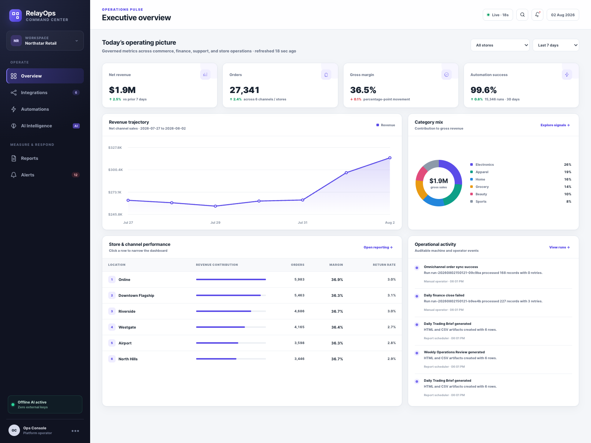
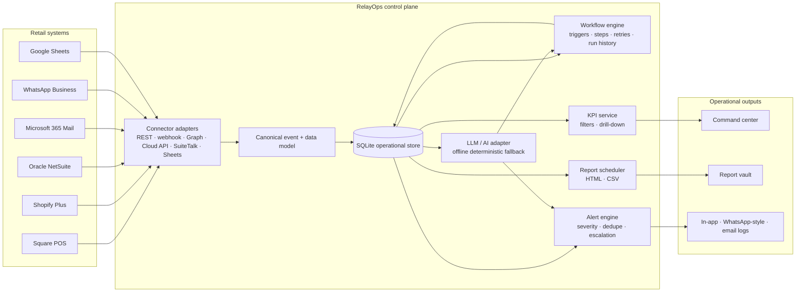
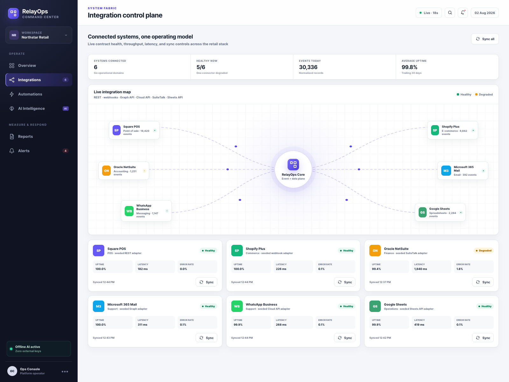
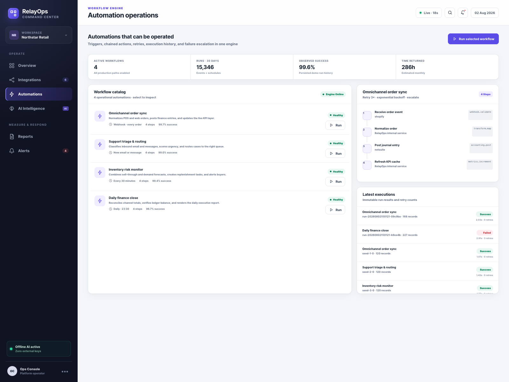
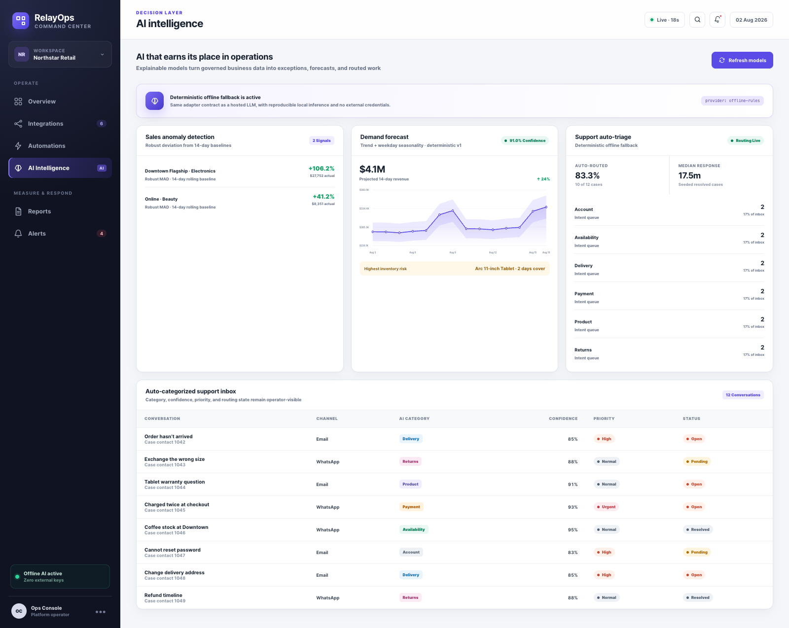
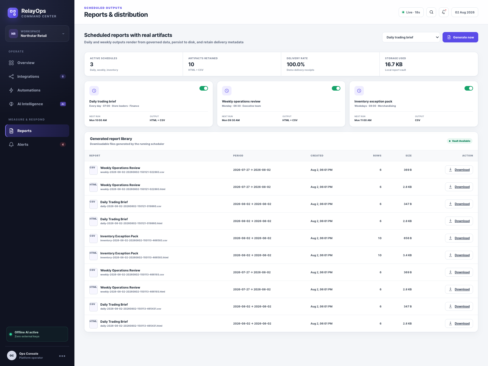
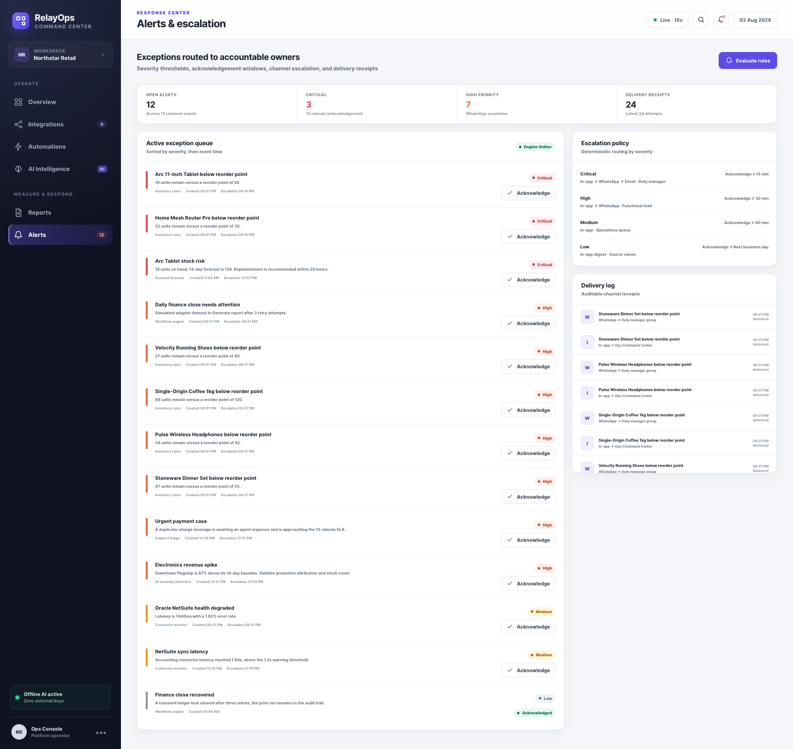
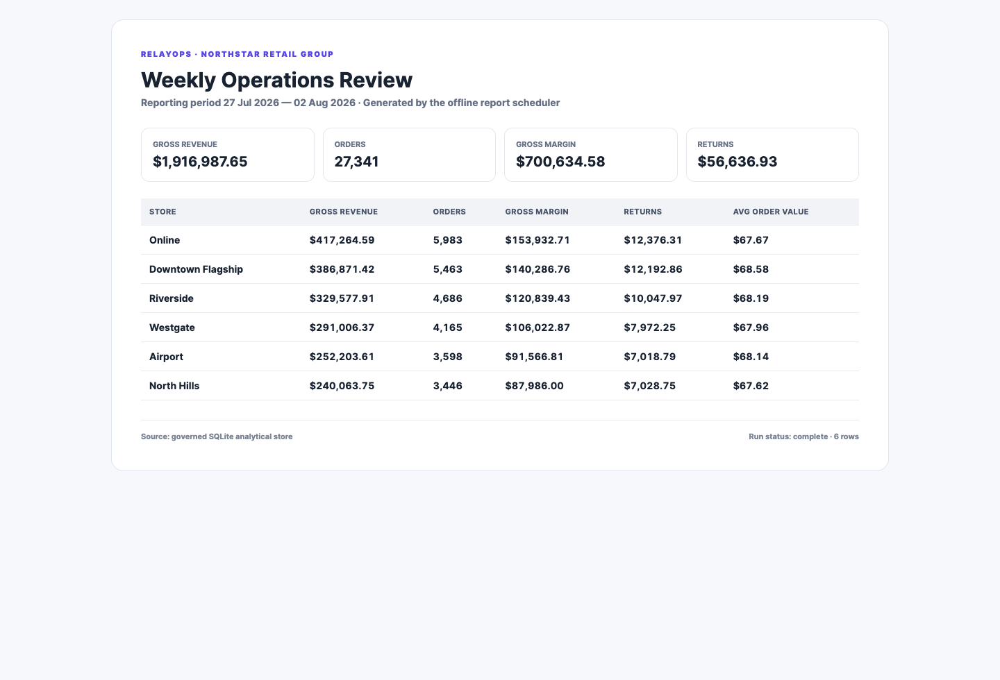

# RelayOps — AI Automation & Integration Command Center


RelayOps is a self-contained operations platform for a mid-size retail group. It connects commerce, finance, support, messaging, and spreadsheet systems; runs chained automations; applies useful AI; exposes drillable KPIs; produces real scheduled files; and escalates operational exceptions with a delivery audit trail.

It runs locally with Python and SQLite. The AI adapter defaults to deterministic offline inference, so the complete demo works without credentials or third-party services.



## What the demo proves

- Six production-shaped connector contracts on a live integration map, with health, uptime, latency, error rate, throughput, sync actions, and a degraded-state example.
- A lightweight workflow engine with event/schedule/manual triggers, ordered steps, persisted runs, per-step outputs, retries, skipped branches, error details, and alert escalation.
- An AI layer behind a provider adapter: robust sales anomaly detection, 14-day demand forecasting, inventory risk scoring, and support intent/priority classification.
- An executive KPI surface with 1/7/30-day filters and store/channel drill-down.
- A report scheduler that writes downloadable HTML and CSV artifacts for daily, weekly, and inventory reporting.
- An alert engine with severity, acknowledgement windows, deduplication, escalation policy, and in-app/WhatsApp-style/email delivery receipts.

All connector calls in this public portfolio build use deterministic seeded adapters. The contracts, transformations, health telemetry, run engine, database writes, reports, and UI interactions are real; no claim is made that the demo is connected to a live tenant.

## Run it

Requirements: macOS, Linux, or Windows with Python 3.9 or newer. There are no third-party Python dependencies.

```bash
git clone <repository-url>
cd ai-automation-command-center
python3 server.py --reset
```

Open [http://127.0.0.1:4173](http://127.0.0.1:4173). `--reset` rebuilds the deterministic demo snapshot; omit it to retain workflow runs, acknowledgements, and generated-report metadata between sessions.

Run the verification suite:

```bash
python3 -m unittest discover -s tests -v
python3 scripts/verify_live.py
```

Recreate every screenshot with the running server:

```bash
npm install
npm run screenshots -- http://127.0.0.1:4173
```

The Node dependency is only for browser verification and screenshot capture. It is not part of the application runtime.

## Architecture



The backend is deliberately compact: a threaded standard-library HTTP service owns the API boundary, domain modules own the workflow/AI/report logic, and SQLite provides a portable audit store. The browser client is a no-framework SPA using semantic HTML, responsive CSS, and generated SVG charts.

## Systems connected

| Business capability | System | Contract represented | Live evidence in the demo |
|---|---|---|---|
| Point of sale | Square POS | REST adapter | 18,420 records/day, health, latency, order ingestion |
| E-commerce | Shopify Plus | Webhook adapter | Order events, schema validation, commerce throughput |
| Accounting | Oracle NetSuite | SuiteTalk-style adapter | Journal posting, reconciliation, degraded latency, retry path |
| Email | Microsoft 365 Mail | Microsoft Graph-style adapter | Support ingestion and report distribution |
| Messaging | WhatsApp Business | Cloud API-style adapter | Support intake and high-severity escalation delivery |
| Spreadsheets | Google Sheets | Sheets API-style adapter | Inventory reads and operational data exchange |

## Tools and techniques used

| Layer | Tooling | What it does here |
|---|---|---|
| Application | Python 3.9+ standard library | HTTP server, routing, validation, workflow execution, scheduling logic |
| Data | SQLite with WAL and foreign keys | Connectors, sales, tickets, workflows, step runs, alerts, deliveries, schedules, and reports |
| Automation | Custom RelayOps workflow engine | Chained steps, manual/event/schedule triggers, retries, failure branches, audit history |
| AI adapter | `LLMAdapter` with offline rules | Stable provider boundary; deterministic local classification with zero keys |
| Anomaly detection | Median absolute deviation + rolling baseline | Flags material store/category sales deviations with explainable scores |
| Forecasting | Linear trend + weekday seasonality | Produces a 14-day revenue forecast, confidence band, and inventory risks |
| Frontend | Vanilla JavaScript, CSS, HTML, SVG | Six-screen operations console, filters, drill-downs, live actions, charts |
| Reports | Python `csv` + print-ready HTML | Real daily/weekly/inventory files, persisted metadata, download endpoint |
| Quality | `unittest`, live HTTP verifier, Puppeteer Core + Chrome | Domain tests, end-to-end mutations, full-page visual captures |
| Release | Git, GitHub CLI, GitHub Actions | Source history, automated tests, semantic tag, published release |

## Measurable results on the seeded data

The fixed 42-day snapshot contains 1,764 store/category sales aggregates, six stores/channels, ten priority SKUs, twelve support conversations, four workflows, and six connectors. Results are reproducible after every `--reset`.

| Measure | Demonstrated result |
|---|---:|
| Connected systems | 6 across POS, e-commerce, accounting, email, messaging, and spreadsheets |
| Connector throughput | 30,336 normalized records/events today |
| Average connector uptime | 99.85% trailing 30 days |
| Seven-day net revenue | $1,860,351 |
| Seven-day orders | 27,341 |
| Gross margin | 36.5% |
| Workflow volume / weighted success | 15,346 runs / 99.6% |
| Estimated operator time returned | 286 hours per month |
| High-confidence sales anomalies | 2: Downtown Electronics +106.2%; Online Beauty +41.2% |
| Fourteen-day revenue forecast | $4.085M at 91% confidence |
| Support auto-routing | 83.3%; median first response 17.5 minutes |
| Live failure exercise | 3 retries, 1 failed step, downstream skip, 2 escalation deliveries |
| Alert-rule exercise | 7 rules matched, 7 alerts created, 13 delivery receipts |
| Generated outputs | Daily and weekly HTML + CSV, plus inventory HTML + CSV |

`286 hours` is an explicit estimate derived from seeded automation volumes. Revenue, orders, margins, run status, anomaly values, forecast, report rows, alert counts, and delivery records are computed from or persisted into the demo database.

## Major screens

| Integration control plane | Automation operations |
|---|---|
|  |  |

| AI intelligence | Reports and distribution |
|---|---|
|  |  |



## Real generated report files

The report scheduler writes files to `data/reports/` at runtime. Reproducible examples from the verified release are committed here:

- [Daily Trading Brief — HTML](examples/reports/daily-trading-brief.html) · [CSV](examples/reports/daily-trading-brief.csv)
- [Weekly Operations Review — HTML](examples/reports/weekly-operations-review.html) · [CSV](examples/reports/weekly-operations-review.csv)



## Workflow engine behavior

The four seeded automations cover omnichannel order sync, support triage/routing, inventory risk monitoring, and daily finance close. A run:

1. resolves its trigger and ordered step definitions;
2. persists the run before execution;
3. stores each step’s status, duration, attempt, adapter, output, and error;
4. retries the configured failure branch up to three times;
5. marks remaining steps skipped when a branch cannot continue;
6. creates an operational alert and channel delivery receipts;
7. leaves the full record visible in Automation Operations and Alerts.

`scripts/verify_live.py` exercises one successful order workflow and one forced finance-close failure through the public HTTP API.

## AI and offline behavior

`LLMAdapter` is the seam for a hosted provider, but its default is `offline-rules`. No environment variable or network access is required.

- Support classification uses deterministic weighted intent terms plus urgency rules and confidence scoring.
- Sales anomalies use a robust median-absolute-deviation score and a minimum 30% materiality gate.
- Demand forecasting fits a deterministic trend, applies learned weekday seasonality, and exposes ±9% confidence bounds.
- Inventory risk compares current stock, reorder points, and forecast demand to calculate cover days.

This design keeps business workflows stable if the model provider changes or is unavailable, and makes the portfolio demo reproducible.

## How this maps to your screening questions

### 1. Which systems have you connected?

The Integration Control Plane answers this visually and operationally: Square POS, Shopify Plus, Oracle NetSuite, Microsoft 365 Mail, WhatsApp Business, and Google Sheets. Each connector exposes its contract type, health, latency, uptime, error rate, throughput, and sync action. The map also shows how those systems converge on a canonical event/data plane.

### 2. Which AI and automation tools have you used, and what results did they achieve?

The Automation Operations screen demonstrates a custom workflow engine with triggers, chained steps, persisted execution history, retries, failure branches, and escalations. AI Intelligence shows the adapter pattern plus explainable anomaly detection, demand forecasting, inventory risk, and support categorization. The seeded result table above quantifies throughput, success rate, anomalies, forecast value/confidence, routing rate, response time, and time returned.

### 3. What is your experience with dashboards, KPIs, automated reports, and operational alerts?

The Executive Overview provides period filters, store drill-down, KPI deltas, revenue trend, category mix, store performance, and audit activity. Reports & Distribution schedules and generates real daily/weekly files. Alerts & Escalation demonstrates severity, ownership, acknowledgement windows, deduplication, multi-channel escalation, and delivery receipts.

## API surface

| Method | Route | Purpose |
|---|---|---|
| `GET` | `/api/dashboard?days=7&store=All%20stores` | KPIs, trend, category/store drill-down, audit events |
| `GET` | `/api/connectors` | Connector map, contracts, health, throughput |
| `POST` | `/api/connectors/{id}/sync` | Run a connector sync checkpoint |
| `GET` | `/api/workflows` | Workflow definitions, steps, recent run history |
| `POST` | `/api/workflows/{id}/run` | Execute a persisted workflow run |
| `GET` | `/api/intelligence` | Anomalies, forecast, inventory risk, support triage |
| `POST` | `/api/intelligence/refresh` | Recalculate the offline AI layer |
| `GET` | `/api/reports` | Schedules and generated-file metadata |
| `POST` | `/api/reports/generate` | Generate daily, weekly, or inventory HTML/CSV |
| `GET` | `/api/alerts` | Alerts, escalation policy, delivery log |
| `POST` | `/api/alerts/evaluate` | Evaluate threshold rules and deliver new alerts |
| `POST` | `/api/alerts/{id}/ack` | Persist acknowledgement state and time |

## Repository map

```text
app/
  dashboard.py      KPI, connector, and alert query services
  db.py             schema plus deterministic retail seed
  engine.py         workflow execution and alert evaluation
  intelligence.py   offline AI adapter, anomalies, forecasts, triage
  reports.py        report schedules and HTML/CSV renderer
static/              six-screen web command center
tests/               domain and persistence tests
scripts/             live API verifier and browser capture
examples/            release screenshots and generated report samples
server.py            standard-library HTTP/API entry point
```

## Quality and release evidence

- Seven automated tests cover every required system domain, KPI drill-down, workflow success/failure paths, deterministic AI, real report files, alert deduplication/deliveries, and run history.
- The live verifier drives the running HTTP server and mutates the real SQLite database.
- Three documented visual/report iteration passes are recorded in [QUALITY_LOG.md](QUALITY_LOG.md).
- Dependency audit: zero high-severity vulnerabilities at release capture.
- Release details are in [RELEASE_NOTES.md](RELEASE_NOTES.md).

## License

MIT
