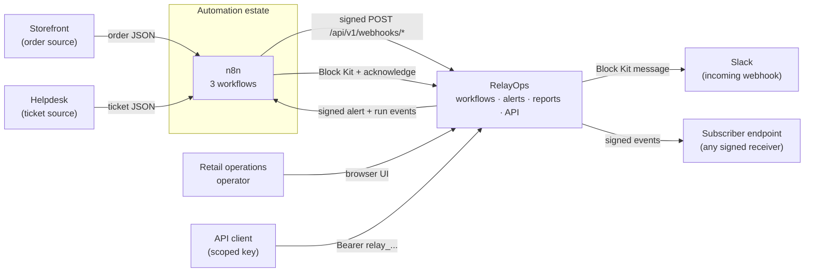
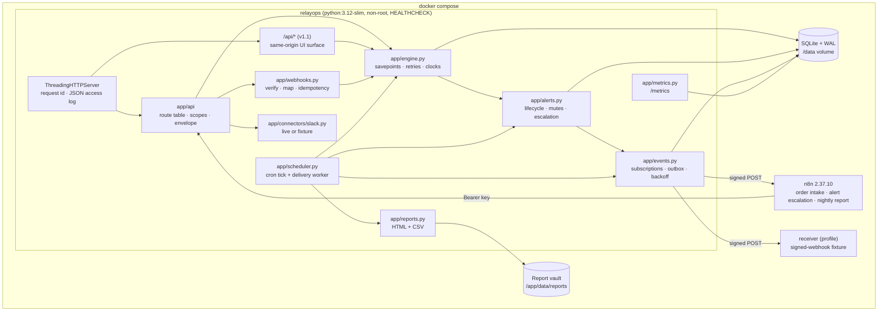
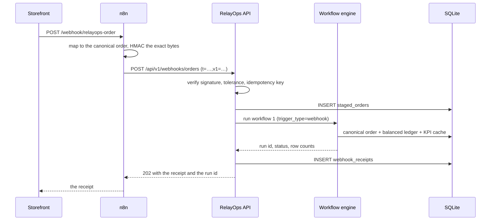
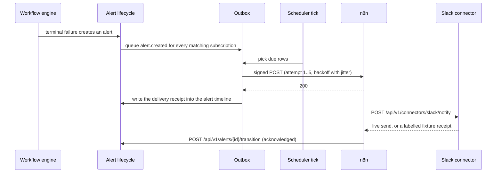

# RelayOps architecture

RelayOps is a retail operations control plane that runs as **one Python process on
SQLite with no third-party runtime dependency**. v1.2 keeps that promise and adds
an integration surface: a versioned REST API, signed webhooks in both directions,
a Slack connector, and three n8n workflows that make RelayOps part of a wider
automation estate.

Honesty labels used below: **VERIFIED** (measured on a running system),
**[INFERRED]** (a design call, not a measurement).

## C4 level 1 — system context



The storefront and helpdesk in this repository are **synthetic**: the demo data is
seeded and every screen says so. The n8n workflows, the signatures, the API and
the delivery machinery are real and exercised by CI. **VERIFIED** — the CI job
`n8n-e2e` imports the workflows into a fresh n8n container, fires an order at its
production webhook, and asserts the order reached RelayOps and the escalation came
back as a Slack connector receipt.

## C4 level 2 — containers



## Trust boundaries

| Boundary | What crosses it | How it is authenticated |
|---|---|---|
| Machine client → `/api/v1/*` | JSON over HTTP | `Authorization: Bearer relay_<id>_<secret>`; the secret is stored as a PBKDF2-HMAC-SHA256 hash with a per-key salt, and every route declares the scope it needs. |
| Storefront / helpdesk → `/api/v1/webhooks/*` | Raw request bytes | `X-RelayOps-Signature: t=…,v1=…` over `"{t}.{raw body}"`, inside a per-source tolerance window, with an idempotency key. No API key: the caller is a system, not an account. |
| RelayOps → subscriber | Signed event JSON | The same scheme, signed with that subscription's secret, so the receiver can verify RelayOps the way RelayOps verifies its callers. |
| RelayOps → Slack | Block Kit JSON | The incoming-webhook URL is the credential and lives only in `SLACK_WEBHOOK_URL`; with no URL the payload is recorded as a fixture receipt instead of being invented. |
| Browser → `/api/*` | JSON over HTTP | Unauthenticated, same-origin, exactly as in v1.1. This surface is for the operator UI served by the same process; it is not part of the OpenAPI contract, and a deployment that exposes RelayOps publicly must put its own front door in front of it. **[INFERRED]** — a deliberate boundary, stated rather than hidden. |

## Data flow — an order that arrives as a webhook



A replay of the same delivery returns the first receipt, increments its `replays`
counter, and creates nothing. **VERIFIED** by
`tests/test_webhooks_inbound.py::test_replay_returns_the_first_receipt_and_creates_nothing`.

## Data flow — an alert that leaves as a webhook



A receiver that never answers is retried five times with exponential backoff and
jitter, then moved to `dead_letter` — visible on the Webhooks screen with a
**Retry now** button, never silently dropped. **VERIFIED** by
`tests/test_webhooks_outbound.py::test_exhausted_attempts_dead_letter_and_can_be_retried`.

## Why these shapes

- **One route table.** `app/api/__init__.py` is the only description of what the
  server answers, and `tests/test_openapi_contract.py` compares it with
  `docs/openapi.v1.yaml` in both directions. A route without documentation and a
  document without a route both fail the build. See ADR 0002.
- **The outbox lives in the same transaction as the business change.** An alert
  and the intent to tell the world about it are written together, so a crash
  between them is not possible; delivery is a separate, retryable concern.
- **The delivery worker runs inside the existing scheduler thread** rather than in
  a new process, because RelayOps is deliberately one process with no broker. The
  tick already holds a lock, so deliveries cannot overlap. See ADR 0004.
- **The runtime stays standard library only.** Dev tooling may use packages; the
  application may not, and `tests/test_runtime_boundary.py` enforces it. See ADR 0001.

## Where things live

```text
app/api/              route table, scoped API keys, error envelope, handlers
app/errors.py         the shared ApiError/Response types (outside app.api, on purpose)
app/signing.py        HMAC-SHA256 signing and verification, both directions
app/webhooks.py       inbound: verify, map, stage, run, receipt
app/events.py         outbound: subscriptions, outbox, delivery worker, dead-letter
app/connectors/       outward connector adapters (Slack, live or fixture)
app/metrics.py        Prometheus text format from stdlib counters
app/logs.py           one JSON line per request, with its request id
docs/openapi.v1.yaml  the hand-authored contract, served and tested
integrations/n8n/     three workflows exported from a real n8n instance
integrations/receiver/ a signed-webhook receiver for watching deliveries
```
